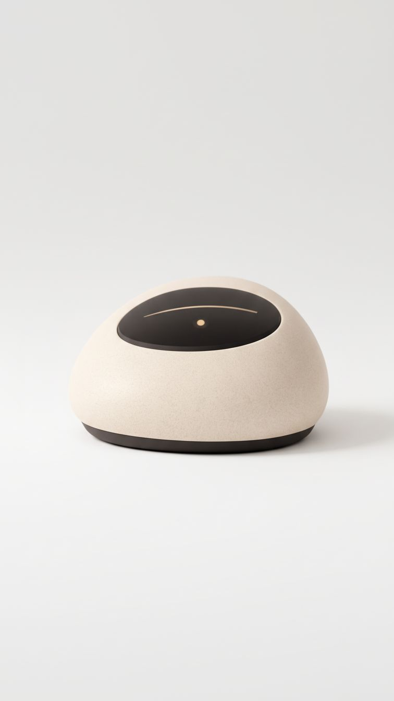

<p align="center">
  
</p>

<h1 align="center">MITR</h1>

<p align="center">
  <strong>A voice-first companion for India's elders — spiritual, warm, and always present.</strong>
</p>

<p align="center">
  Built with LiveKit Realtime Voice &middot; OpenAI &middot; Expo &middot; Node.js
</p>

---

India's elderly population is 140 million and growing. Many live alone or with limited daily interaction. They don't need another screen — they need someone to talk to. Someone who speaks their language, knows their prayers, remembers their grandchildren's names, and plays the right bhajan at the right time of day.

**MITR** (Hindi: मित्र, meaning *friend*) is that companion. A pebble-shaped voice device that sits on a bedside table and is always ready to listen, talk, pray, sing, remind, and care.

<p align="center">
  
  &nbsp;&nbsp;&nbsp;
  
</p>

## Why This Exists

Most AI companions are built for young, English-speaking, tech-savvy users. India's elders are none of those things — and they're the ones who need companionship the most.

MITR is designed from the ground up for people who:
- Speak Hindi, Tamil, Telugu, Bengali, Marathi, Gujarati, Kannada, Punjabi, or Odia
- Have deep spiritual and cultural lives that generic assistants cannot serve
- Need medication reminders, not productivity hacks
- Want to hear the Ramayana, not a podcast

This isn't Alexa with a temple skin. Every feature is built around Indian elder care.

## Features

### Conversation & Companionship
The core of MITR. No wake word, no task required — just talk. MITR carries open-ended conversation in the user's native language, recognizes emotional tone, and adapts. If someone sounds lonely, it shifts toward comfort. It never ends a conversation abruptly.

### Satsang (Spiritual Sessions)
Interactive scripture sessions with structured flow control. MITR can lead a user through the Bhagavad Gita verse by verse, explain each shloka in simple language, and play ambient devotional music in the background — all through voice alone.

- Guided scripture walkthroughs with `flow_start` / `flow_next` / `flow_stop`
- Covers all 18 Mahapuranas, Ramayana (regional versions), Mahabharata, Bhagavata
- Multi-faith: Hinduism, Sikhism, Jainism, and Islam at depth
- Auto-published ambient audio track during satsang via LiveKit

### Stories & Oral Tradition
Stories from Panchatantra, Jataka tales, lives of saints (Mirabai, Kabir, Tukaram, Guru Nanak, Vivekananda), and regional folk mythology. The same story can be told in 2 minutes or 20, depending on mood.

### Music & Devotion
- Bhajan library — by deity, saint, language, or occasion
- Classical ragas matched to time of day, with explanations of why
- Guided devotional playlists and YouTube media playback
- Festival-specific music and meditation tracks rooted in Indian tradition

### Memory That Matters
MITR remembers everything across conversations — names, preferences, health concerns, family details, past stories shared. It proactively surfaces memories at the right time:

> *"You asked me to remind you about your daughter's anniversary — it's in three days."*

### Reminders & Daily Routine
- Medication reminders — persistent until acknowledged
- Prayer time reminders aligned to specific traditions
- Water, meal, and doctor appointment reminders
- Morning briefing: *"Good morning. Today is Tuesday, Hanuman's day. Your blood pressure medicine reminder is at 9am. Shall I tell you today's shloka?"*

### Panchang & Festivals
Location-aware Hindu calendar integration — tithi, nakshatra, Rahu Kaal, sunrise/sunset. Automatic festival awareness with significance explanations.

### Health & Wellness
- Guided pranayama (Anulom Vilom, Bhramari, Kapalbhati) explained in traditional terms
- Yoga nidra for sleep
- Mood check-ins — casual, never clinical
- Identifies concerning patterns and can alert family

### Brain Games & Mental Stimulation
Memory games, name-that-deity, shayari completion, riddles from Indian folk tradition — keeping minds sharp through culture, not clinical exercises.

### Family Connection (Mobile App)
Family members install a companion app to stay connected:
- Send voice messages that play on the device at a set time
- Receive voice replies from the elder
- See gentle activity summaries (*"Nani spoke for 45 minutes today"*)
- SOS button for immediate family calls

### Personal Diary
Voice-recorded journal entries. MITR prompts with questions and records answers as an ongoing audio memoir — preserving stories that would otherwise be lost.

<p align="center">
  
</p>

## Architecture

```
mitr-backend/          API server + LiveKit agent worker + all tools/services
mitr-mobile/           Family caregiver app (Expo Router, iOS)
stories_curated.jsonl  Curated story corpus
```

The backend runs two processes:
1. **API Server** — REST endpoints for auth, elder management, family connections, device status, and health checks
2. **Agent Worker** — LiveKit agent that handles real-time voice via OpenAI Realtime API, with 20+ async tools for low-latency response

### Tool Surface
All tools are optimized for voice latency — async tools return a fast acknowledgment first, then deliver detailed results as a follow-up:

| Category | Tools |
|---|---|
| Spiritual | `flow_start`, `flow_next`, `flow_stop`, `religious_retrieve`, `festival_context_get` |
| Stories | `story_retrieve` |
| Memory | `memory_add`, `memory_get` |
| Reminders | `reminder_create`, `reminder_list` |
| Music | `devotional_playlist_get`, `youtube_media_get` |
| Information | `news_retrieve`, `panchang_get`, `daily_briefing_get` |
| Wellness | `pranayama_guide_get`, `brain_game_get` |
| Journal | `diary_add`, `diary_list` |
| Health | `medication_adherence_setup` |

## Getting Started

### Prerequisites
- Node.js 18+
- pnpm
- PostgreSQL & Redis
- ffmpeg (for satsang ambience audio)
- LiveKit server credentials
- OpenAI API key

### Setup

```bash
# Install dependencies
pnpm install

# Configure environment
cp mitr-backend/.env.example mitr-backend/.env
# Fill in API keys and LiveKit credentials

# Start API server
pnpm dev:api

# Start agent worker (new terminal)
pnpm dev:agent

# Start mobile app (new terminal)
pnpm dev:mobile

# Optional: web voice simulator
cd mitr-backend && pnpm test:web
# Open http://localhost:8787
```

### Verify It Works

```bash
# Health check
curl http://localhost:8080/healthz

# Connect via web simulator and say:
# "Satsang shuru karo" → starts a guided scripture session
# "Koi kahani sunao" → tells a story
# "Kal subah 7 baje dawa ka reminder" → sets a medication reminder
```

## The Device

<p align="center">
  
</p>

MITR is shaped like a river pebble — smooth, warm, and familiar. No screen to navigate, no buttons to learn. Just touch and talk. It sits naturally on a bedside table, a prayer shelf, or in the palm of a hand.

The design is intentional: technology should disappear. What remains is a friend.

## License

This project is source-available. See [LICENSE](LICENSE) for details.

---

<p align="center">
  <em>Built with care for the people who raised us.</em>
</p>
